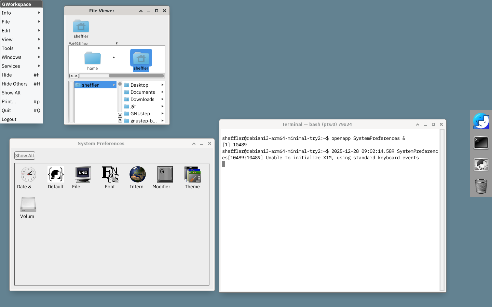

# Debian13 GNUstep Minimal

Build minimal GNUstep development graphical environment.

- GWorkspace and GTerminal
- development tools (compilers, headers, git)
- compatible/minimal windowmanager and login manager
- objc++ capable development environment
- vbox-ready for use with VirtualBox

Is [McLarenLabs](https://github.com/mclarenlabs/libs-mclaren-alpha) development ready:

- libasound2-dev
- alsa-utils
- libsndfile
- libresample
- gnustep/libs-steptalk

## Procedure

Start with a small Debian Net Installer and install a Full desktop environment.  I used Debian.

- https://mirrors.ocf.berkeley.edu/debian-cd/13.2.0/arm64/iso-cd/
- debian-13.2.0-arm64-netinst.iso - 736 MiB

These steps shoud be followed and performed manually in a terminal.  I like to run everything from my home directory and keep all git repositories in `~/git` You will be prompted for sudo.  You should have already installed a complete desktop environment like Debian.

1. Install Dependencies

        su
    	./git/gnustep-build/debian-13/bootstrap.sh
		exit

2. Set up SUDO

		su
		/usr/sbin/usermod -aG sudo sheffler
		exit
		(reboot)
	
3. Fix up audio for VirtualBox if needed.  These scripts lengthen buffers.

		./git/gnustep-build/debian-13/audio.sh
	
4. Fetch sources

		./git/gnustep-build/debian-13/checkout.sh
	
5. Apply patches to sources.

		./git/gnustep-build/debian-13/patch.sh
	
6. Build sources

		./git/gnustep-build/debian-13/build.sh

7. Install and configure fonts, if desired.

		./git/gnustep-build/debian-13/fonts.sh
	
8. Configure the RIK theme, if desired.

		./git/gnustep-build/debian-13/theme.sh
	
9. Set up a DESKTOP item so you can select the GNUstep alternate environment from the login manager.

		./git/gnustep-build/debian-13/desktop.sh
	

## Notes

- the resulting system will leave executables that can be run under the Debian Gnome environment, or in the specific GNUstep desktop.  Either will work.

- debian13 has clang-19.  The source I used to build this in December 2025 was Tagged: swift-DEVELOPEMENT-SNAPSHOT-2025-12-19-a. Older versions of swift-corelibs-libdispatch do not pass strict type checking of newer clang.

- gershwin-terminal includes `-liconv` in GNUmakefile.preamble, which might be needed on FreeBSD but is not needed on Debian13 and must be removed.

- be sure to check sudo is working

- audio fixes are optional.  Claude helped debug this and provided the pipewire and alsa plugin tweaks.
